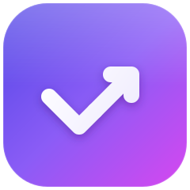
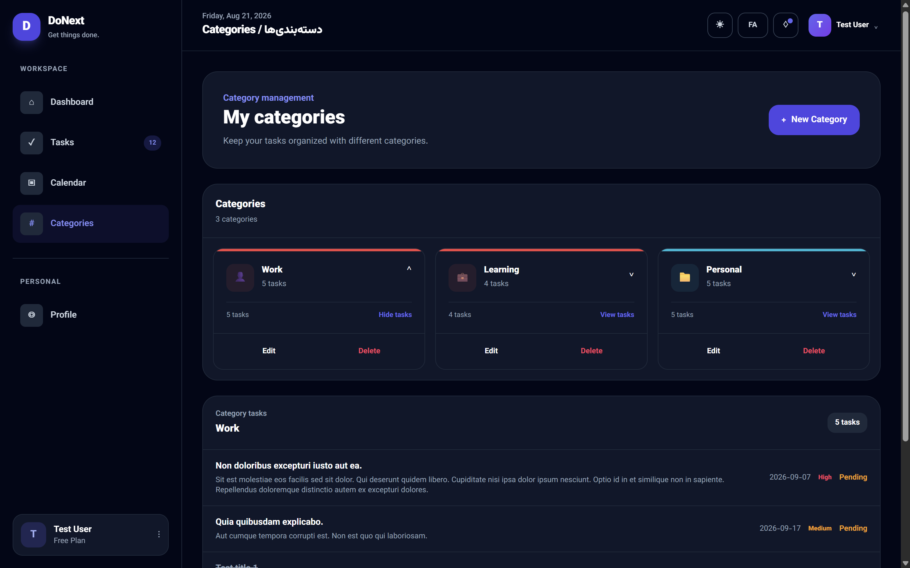
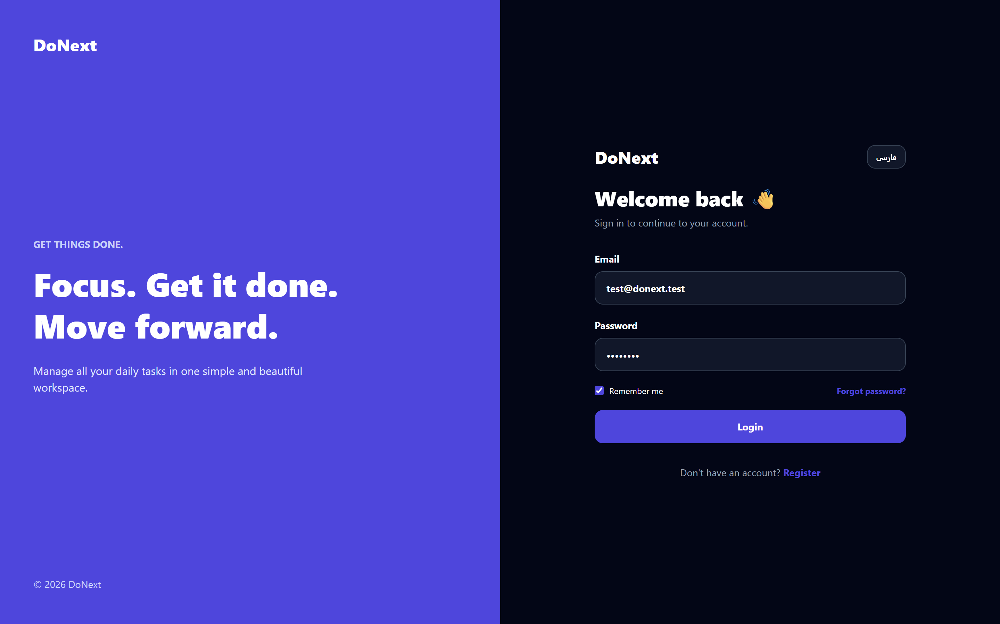

<p align="center">
  
</p>

<h1 align="center">DoNext</h1>

<p align="center">
  <b>A fast, focused personal task &amp; calendar manager<br>built with Laravel &amp; Livewire</b>
</p>

<p align="center">
  
  
  
  
  
</p>

<p align="center">
  <b>🇬🇧 English</b> &nbsp;•&nbsp; <a href="README.fa.md">🇮🇷 فارسی</a>
</p>

<br>

<p align="center">
  
</p>

---

**DoNext** is a clean, no-nonsense task manager for people who just want to plan their day and get things done.  
It pairs a powerful task list with a full calendar view, color-coded categories, and a dashboard that actually shows you how your week is going — all in a fast, reactive Livewire interface with **zero page reloads**.

<br>

## ✨ Features

<table>
  <tr>
    <td width="50%" valign="top">
      <h3>📊 Smart Dashboard</h3>
      <p>Total / completed / today's tasks, completion rate, upcoming tasks, and a beautiful 7-day completion chart.</p>
      
    </td>
    <td width="50%" valign="top">
      <h3>✅ Powerful Task Management</h3>
      <p>Create, edit, complete &amp; delete tasks with priority (low / medium / high), due dates, and categories.</p>
      
    </td>
  </tr>
  <tr>
    <td width="50%" valign="top">
      <h3>📅 Full Calendar View</h3>
      <p>Month view with tasks per day, quick-add for any date, and one-click completion toggling.</p>
      
    </td>
    <td width="50%" valign="top">
      <h3>🏷️ Beautiful Categories</h3>
      <p>Custom categories with colors &amp; icons, plus per-category task counts and filtered views.</p>
      
    </td>
  </tr>
</table>

<br>

### More highlights

| Feature | Description |
|--------|-------------|
| 🔍 **Search & Filters** | Instant search + filter by All / Pending / Completed / Due Today |
| 👤 **Profile** | Edit name & email + personal completion-rate summary |
| 🔐 **Authentication** | Login, Register, Forgot & Reset Password — ready out of the box |
| ⚡ **Reactive UI** | 100% Livewire — instant interactions, no custom JS framework needed |

<br>

<p align="center">
  
  &nbsp;
  
</p>

<p align="center">
  
</p>

---

## 🛠️ Tech Stack

| Layer | Technology |
|-------|------------|
| **Backend** | PHP 8.2+ · Laravel 12 |
| **Frontend** | Livewire 3 · Tailwind CSS 4 · Vite |
| **Database** | SQLite by default (any Laravel-supported DB works) |
| **Testing** | PHPUnit |

---

## 🚀 Getting Started

**Requirements:** PHP ≥ 8.2 · Composer · Node.js ≥ 18 · npm

```bash
# 1. Clone the repository
git clone https://github.com/RezaSahraie/DoNext.git
cd DoNext

# 2. Install dependencies
composer install
npm install

# 3. Configure the environment
cp .env.example .env
php artisan key:generate

# 4. Set up the database (SQLite by default)
touch database/database.sqlite
php artisan migrate

# 5. Run the app (server + queue + Vite, all at once)
composer run dev
```

Then open **http://localhost:8000** and create an account to get started 🎉

---

## 📁 Project Structure

```text
app/
 ├─ Livewire/          # Dashboard, Tasks, Calendar, Categories, Profile, Auth
 └─ Models/            # User, Task, Category
database/
 └─ migrations/        # tasks & categories schema
resources/views/
 └─ livewire/          # Blade views for every component
routes/web.php         # Application routes
docs/assets/           # Screenshots & logo used in this README
```

---

## 🧪 Running Tests

```bash
php artisan test
```

---

## 🤝 Contributing

Contributions are welcome!  
Feel free to open an issue or submit a pull request.

---

## 📄 License

Released under the **MIT License**.

<br>

<p align="center">
  <sub>Made with ❤️ using Laravel &amp; Livewire</sub>
</p>
